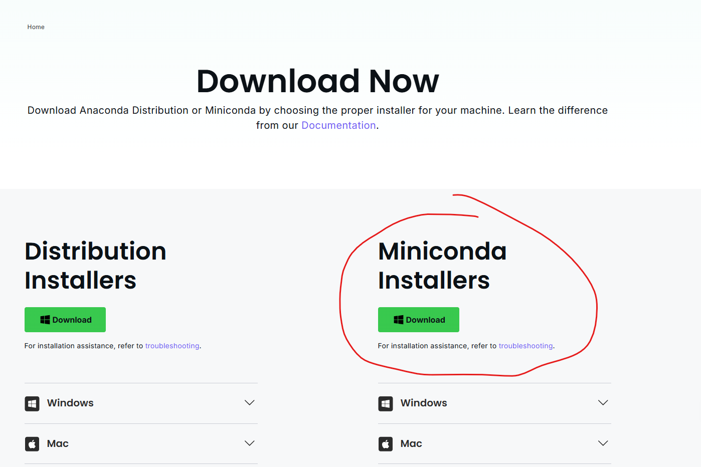
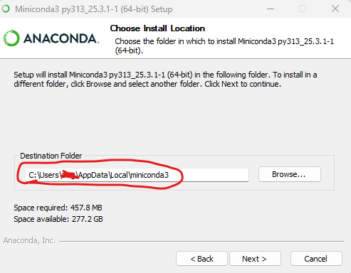
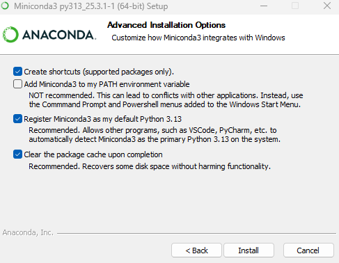

# Virtual Environment Setup in Python

---
Python virtual environments allow you to isolate groups of python pacakges to minimize clashes between different package dependencies (often referred to, affectionately, as *"dependency hell"*).

## Using your root python environment

When you install python using the installer from the [python.org website](https://www.python.org/downloads/), it will install a root python executable file (i.e. `python.exe`) that should be available to use via your $PATH variable. To see where this root executable file lives on your Windows computer, open a Windows Powershell terminal use the following command:

```bat
$env:path -split ';'
```

This should print a bunch of file paths to directories that contain *.exe files. Look through this list and find a file path that ends with `\Python\Python313` (if you are using python 3.13, for example) as well as one that ends with `\Python\Python313\Scripts`. If these two paths are in your $PATH variable, then typing `python.exe` into your terminal and pressing enter will allow you to enter the python REPL (which stands for read-eval-print-loop), which allows you to run line-by-line python commands. For example, you could run:

```python
>>> print('hello world')
>>> import sys
>>> print(sys.path)
```

Entering these commands (being sure to press enter to run them after each line) will print `"hello world"`, just to double check that its all working properly, import the standard python library `sys`, then use this library to print the paths that your root python is using to find the `python.exe` file. To leave the python REPL, just enter the command `quit()`.

## Using python's built-in `venv` module

Being able to access your root python environment is great and all, but as you continue to use python, you will need to install many different packages from all over the internet, and each package comes with a set of dependencies (i.e. other python packages that the main package depends on to run properly) and each of these dependencies may have their own set of dependencies and before you know it, you might try to install a crucial python package, but your root environment is so full of dependencies that it either runs too slowly to operate or there is a conflict between dependencies in some unknown location on your computer and the packge you need is unable to be installed. You have now entered dependency hell. Luckily, if you start using virtual environments, you can easily escape this abysmal fate.

The first step is to begin compartmentalizing your python code into different projects, with each project getting its own folder on your computer. If you have a task that you would like to perform with python and it is somewhat unique from other python code that you've written, just make a new folder and change your working directory in your terminal to this folder.

```bat
mkdir ./myproject
cd myproject
```

Once you are in this new project folder, you can create a virtual environment by simply calling the `venv` module from your root python.

```bat
python.exe -m venv [virtual environment name]
```

What this command is doing is telling your root python.exe file to run this `venv` module in "module mode" (`-m`) and the virtual environment name will be the name of the directory that represents your new virtual environment. A typical virtual environment name is ".venv". Using this standard name allows version control systems like git to ignore these directories. You can enter the name of your environment (without the square brackets) at the end of your command.

Finally, you need to activate your virtual environment by running

```bat
.\.venv\Scripts\activate
```

Which will then add a prefix to your terminal line that looks something like:

```bat
(.venv) PS C:\path\to\working\directory> 
```

The name in parentheses indicates the name of the virtual environment that you just set up. Now, running `python.exe` from this activated environment and checking where the executable file is located:

```python
>>> import sys
>>> print(sys.executable)
```

Should print out a path that goes through your newly created virtual environment folder. Now, installing packages using pip:

```bat
pip install numpy
```

will install these packages to the virtual environment, but not to your root environment. If you ever run into issues with your virtual environment getting too clogged with dependent packages, it is quite easy to simply delete the .venv folder and start all over! Goodbye dependency hell!

## Using conda environments

Interestingly, python's built-in virtual environment system is not the only package management system you're likely to encounter. Another popular package management system for python is called conda. To get some terminology out of the way for some terms you may encounter in your python journey:

- **conda**: A package manager that can be used like a python virtual environment, but can also install non-python packages.
- **anaconda**: A python *distribution*, which is a set of ~250 pre-installed python packages plus other helpful software, including conda.
- **miniconda**: A more lightweight python distribution which simply includes the base python library and conda.
- **anaconda navigator**: A desktop GUI for interacting with the mess of ~250 pre-installed python packages included with anaconda.

Everyone has different goals when installing python. The whole ideology around python as a coding language is to allow people who are not coders to mindlessly run some code that lets them do something they want to do. I will advocate that for just slightly more work you can ascend beyond this basic python usage strategy and begin to actually understand what you are coding. I believe that taking this time will not only improve your own science, but will allow you follow the rapidly advancing use of code and software applications in almost all fields of science. With that said, let's ignore the gargantuan overkill that is anaconda and anaconda navigator and install miniconda.

### Installing Miniconda

1) Download the miniconda installer from the [Anaconda Website](https://www.anaconda.com/download/success) 

2) Run in the installer.exe file.
3) Make note of where miniconda3 is being installed. 

4) Check the reccomended install options and click "install". 

5) Now, you need to initialize conda in your Windows Powershell $PROFILE file. To do this,  `cd` into your miniconda Scripts folder:

```bat
cd C:\Users\<your_user>\AppData\Local\miniconda3\Scripts
```

From here, you can run the following command to initialize conda:

```bat
.\conda.exe init powershell
```

The output of this command should tell you that some files were modified and that you need to restart your shell for changes to take effect.
6) Restart your shell, and you should see `(base)` at the start of your powershell prompt line.
7) To double check, run `conda info` and it will tell you where it is pulling conda.exe from. While checking the existence of your conda install, this command also provides lots of valuable information such as where the conda configuration file lives and where the base environment is stored.

### Activating your first conda environment

 Before creating your first `conda` python environment, run the following command:

```bat
conda init
```

to initialize conda. What this command does is it modifies the few lines of code that exist in the configuration file (.condarc for windows and .bashsrc (for example) for Mac) to ensure that your computer knows where to look for the conda.exe file everytime you enter a conda command, i.e. `conda ...`.

Time to create your first `conda` python environment! As mentioned earlier, miniconda ships with the latest version of python installed. All we need to do is create an environment for this python installation to live in. We do this by the following command:

```bat
conda create -n "[my_env_name]"
```

This will create a conda environment with python installed. To check on this environment, enter:

```bat
conda envs list
```

This will show you all of the available environments. You should see, if this is your first time using conda, a `base` environment and the name of the environment you just created. `base` contains some basic python packages, but to do any real work, you should "activate" your new conda environment using:

```bat
conda activate [my_env_name]
```

From now on, you should see `(my_env_name)` appear at the beginning of your shell line to indicate which conda environment you are in. From here, you can simply call:

```bat
python.exe --version
```

To check the python version in this environment. Simply running python.exe will begin a python REPL with the pacakge-specific python executable.
