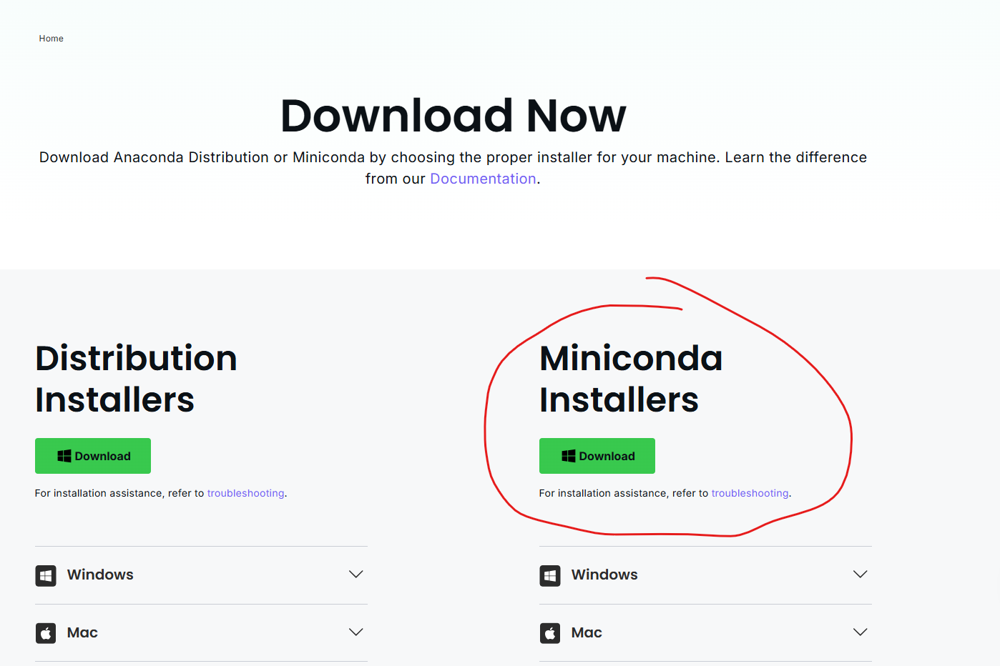
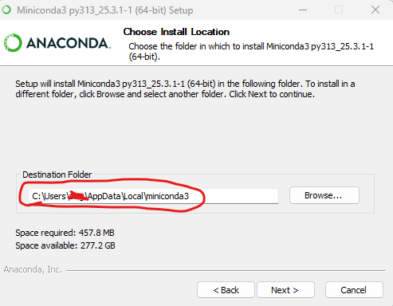
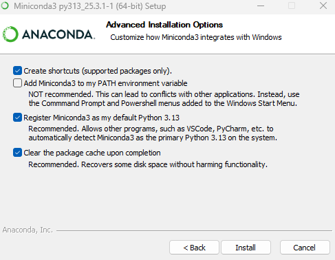

# Miniconda Installation Notes
---

## Windows

1) Download the miniconda installer from the [Anaconda Website](https://www.anaconda.com/download/success) 

2) Run in the installer.exe file.
3) Make note of where miniconda3 is being installed. 

4) Check the reccomended install options and click "install". 

5) Now, you need to initialize conda in your Windows Powershell $PROFILE file. To do this,  `cd` into your miniconda Scripts folder:

```bat
cd C:\Users\<your_user>\AppData\Local\miniconda3\Scripts
```

From here, you can run the following command to initialize conda:

```bat
.\conda.exe init powershell
```

The output of this command should tell you that some files were modified and that you need to restart your shell for changes to take effect.
6) Restart your shell, and you should see `(base)` at the start of your powershell prompt line.
7) To double check, run `conda info` and it will tell you where it is pulling conda.exe from.
