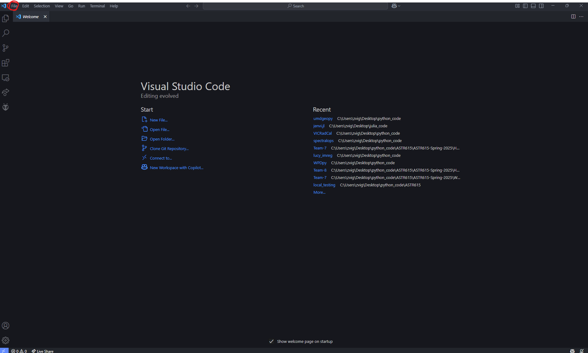
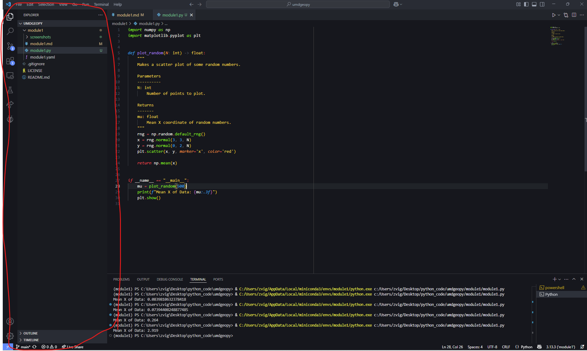
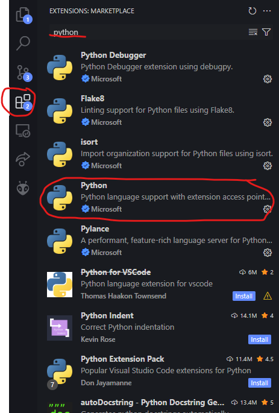
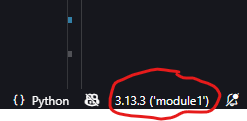
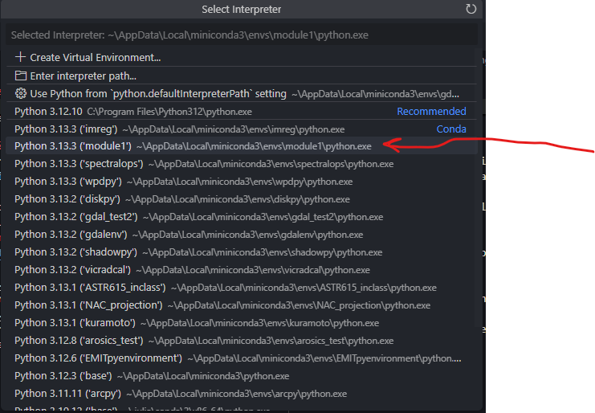

Module 1: Installing Python the Right Way :computer:
---

## Background
Python is deceivingly simple to download. You can go to [python.org](https://www.python.org/downloads/) and download the latest version (3.13 as of May, 2025) or to [anaconda.com](https://www.anaconda.com/download) and get an out-of-the-box python playground. However, especially for scientists, these download methods are not a great solution for longevity of your installation. When it comes time to update your python or install a package that needs a downgraded version of python, why would you stop your science to back to those websites and figure out what version of python you need, what folder it needs to be put into, how many packages need to be re-installed, etc... An ideal download method for scientists is one that requires the most minimal effort to maintain given the passing of time and the exploration of community-made packages. To achieve this goal, this module will walk through how to download python via a package manager, how to use this package manager to maintain and partition python environments for your different projects and, finally, how to share your python environments with scientists. If there is time, this module will finally go over what an IDE is and how it can incorporate the python environments you just created.

## Module Tasks
- [ ] Download and Install Conda via the Miniconda distribution
- [ ] Create a new python environment
- [ ] Install some useful packages into this environment
- [ ] Export this environment to .yaml (BONUS: Install someone else's environment)
- [ ] Activate this environment in a shell and in VSCode (or another IDE)

## For Windows Users
### Downloading Miniconda
Windows users can simply go online and [download](https://www.anaconda.com/download) the latest miniconda distribution. After downloading the .exe file, launch it and follow the prompts. Pay close attention to where this is installed as we will visit this directory later.

## For Mac (and Linux) Users
### Installing Homebrew
MacOS in particular has a very broad and useful package manager called `homebrew`. I reccomend using this to install conda without ever having to open a browser. Simply copy and paste this into a `bash` shell and it should install automatically.
```bash
/bin/bash -c "$(curl -fsSL https://raw.githubusercontent.com/Homebrew/install/HEAD/install.sh)"
```
### Installing Conda
From there, you can use homebrew via the `brew` command. Start by checking on the installation of homebrew:
```bash
brew --version
```
If this is succesful, install conda via the following command:
```bash
brew install --cask conda
```
where the `--cask` flag is simply telling what box of packages to grab conda from.

## Using Conda
### Configuring Conda
Before any python installation, we must do a little bit of configuration. First, check the status of your installation using the following command:
```
conda info
```
While checking the existence of your conda install, this command also provides lots of valuable information such as where the conda configuration file lives and where the base environment is stored. Finally, before creating your first python environment, run the following command:
```
conda init
```
to initialize conda. What this command does is it modifies the few lines of code that exist in the configuration file (.condarc for windows and .bashsrc (for example) for Mac) to ensure that your computer knows where to look for the conda.exe file everytime you enter a conda command, i.e. `conda ...`.

NOTE: Sometimes, on mac, the above command says that it did not make any modifications. In this case, try putting the name of your desired shell into the command. For example:
```bash
conda init zsh
```

### Creating your first python environment
Time to create your first python environment! As mentioned earlier, miniconda ships with the latest version of python installed. All we need to do is create an environment for this python installation to live in. We do this by the following command:
```
conda create -n "[my_env_name]"
```
This will create a conda environment with python installed. To check on this environment, enter:
```
conda envs list
```
This will show you all of the available environments. You should see, if this is your first time using conda, a `base` environment and the name of the environment you just created. `base` contains some basic python packages, but to do any real work, you should "activate" your new conda environment using:
```
conda activate [my_env_name]
```
From now on, you should see `(my_env_name)` appear at the beginning of your shell line to indicate which conda environment you are in. From here, you can simply call:
```
python.exe --version
```
To check the python version in this environment. Simply running python.exe will begin a python REPL with the pacakge-specific python executable.
### Installing your first python packages
There are two ways to instal Python packages into a conda environment.

**Using Conda**
```
conda install [some_package]
```
From there, conda will begin by install this packages dependencies and will move on to make sure this package is compatible with all the other packages already installed in [my_env_name]. It will stop part way through an installation, however, to show you where the environment is located and what new packages will be installed to statisfy all dependencies. You will then need to enter `y` to proceed with installation. To see a list of packages currently installed in your environment, simply run:
```
conda list
```
and look for [my_env_name] among the many other installed packages.

**Using `pip`**
Not all python packages are available through Conda alone. Some must be installed with the base python package manager, called `pip`. To use `pip` within the context of a conda environment, first install pip using
```
conda install pip
```
You will then need to find the `pip3.exe` executable file **in your environment**. To do this, locate the environment location that was shown to you during package installation. In windows, my path looks something like:
```
C:\Users\zvig\AppData\Local\miniconda3\envs\module1\
```
In MacOS:
```
/opt/homebrew/Caskroom/miniconda/base/envs/module1/
```
You can either enter the full path to your `pip` executable (`{env_path}/Scripts/pip3.exe` on Windows or `{env_path}/bin/pip3.exe` on Mac) or change your working directory to the directory containing the `pip` executable and run:
```
pip3 install [package name]
```
**Note**
Only use `pip` to install packages that cannot be installed using conda, as conda cannot control the dependencies as well for packages installed via `pip`.

### Shipping your python packages
To export an environment so someone else can use it, the command is simply:
```
conda env export > [my_env_name].yaml
```
This will create a human-readable log of all the packages you have installed in this specific environment. To then take this file and create a new local environment out of it, use:
```
conda create -f [my_env_name].yaml
```
This will create an identical environment to [my_env_name] in the current directory.

#### Pro Tip
Do not be afraid to just create a new conda environment. If you have to use a large package with lots of dependencies, for example, do not try to install it in the base environment, in hopes of avoiding dependency conflicts.

#### What's IDE, and Why Use One?
An Integrated Development Environment (IDE) is a graphical tool designed to make coding easier than simply typing code in a blank text file. While some are heavy, full-featured IDEs, like PyCharm, others are lightweight and bare-bones like Windows Notepad. So what IDE should you choose as a scientist??

I personally have found VSCode to be the sweetspot between overhead computing cost and useful features that help you write code easily. Plus, it allows the use of other scientific computing languages such as R, Latex and, yes, even MatLab!
##### Activating a python environment in VSCode
You can download VSCode [here](https://code.visualstudio.com/download). The first thing you will see when you open your new IDE is a blank page. Locate the file menu and select Open Folder...

Open a new folder in a place where you will keep all of your python code. Once you do this, a file explorer menu will appear on the left-hand side of your IDE.

I already have a python file open, but you should find the "New File..." button located at the top of this file explorer and create a new file with the extension ".py" to indicate that it is a python file. Open this file and try to import some of the packages you installed in your conda environment. For example:
```python
import numpy as np
import matplotlib.pyplot as plt
```
Running this file may or may not work at this point for two reasons: 1) VSCode does not know what a python file is yet or 2) VSCode does not know what environment to look for!

To solve the first issue, locate the extensions tab on the left hand ribbon and search for the python extension (see below). Once this extension is added, VSCode knows what to do with files that have the *.py ending.

Now VSCode may be able to locate a default installation of python, but to ensure you are using the right environment, select your conda environment from the bottom right corner of VSCode.

This will open up a list of environments. Simply select your desired environment and all the packages in this environment will be available to use in your IDE.

You should now be able to run your code to import the modules you installed in your conda environment!

## Final Thoughts
Installing python modules written by others and using them in your own code is one of the most useful skills that a scientist can have these days! Hopefully this module gave you the confidence to be able to do this task sucessfully. You will likely run into struggles as you get into using packages that are less developed than the ones availabe on conda or even `pip`, but this will be an issue for a future module. Finally, I will reiterate the importance of partitioning your python projects into different conda environments. Not only does it help with possibile compatibility issues, but it keeps your projects running quickly, since python does not have to keep track of too many packages when starting up your project. 

Next time, we will go into more depth about using random scientific python packages found on the internet!
