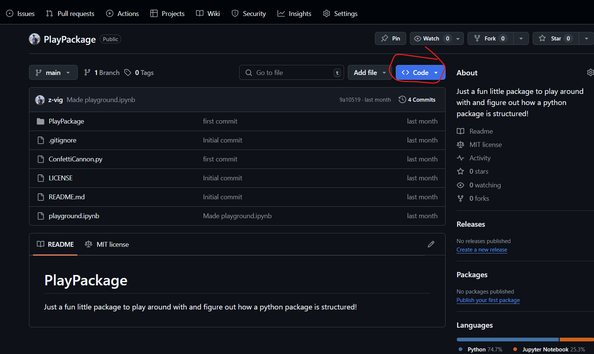

Module 2: Using Scientific Packages from the Internet :mag:
---
### *Part 2: Package Structure*

## Background
The term is thrown around quite a bit among python users. You might have heard early on in your python journey something along the lines of "oh, there's a python package for that!" Unfortunately, unless you have experience either making or using a python package, the term itselfis quite meaningless. In this module, we will go over exactly what a package is and how you, as a scientist, can get into using one right away for your needs, just by looking on the internet!

## Module Tasks
- [ ] Install `git`
- [ ] `clone` a "play package" from github
- [ ] Identify the modules/sub-modules associated with this package
- [ ] For each module/submodule identified, figure out what functions and classes are publicly available to use
- [ ] Select a package of your own on the internet and find its documentation (i.e. the docs)
- [ ] Select a function or class that may be useful to you, figure out its syntax and use away!

## Downloading Git
Since you are viewing this document, you already have experience with github. In order to complete this module, however, you must install `git` and perform a basic operation called `clone`. First, check if you already have `git` installed by running
```
git -v
```
in any terminal. If a response is printed, listing the version of your installation... success! You have `git` installed on your machine! Otherwise, go to the [git website](https://git-scm.com/downloads) and install `git` for your OS. Choose the "standalone installer" to download the `git` installer executable. Run this file, selecting the default options and run the `git` version command shown above to ensure your installation worked.

NOTE: This is a particular scenario where, if you are using windows, you will need to know your processor type. (ARM or x64). If this is new to you, go to your settings>System>About menu and look for the "system type" entry. It should either say x64 (i.e. 64-bit, a.k.a. AMD) or ARM.

## Cloning A Package from Github
Once `git` is installed, you can move on to cloning a repository. For this
module, we will clone a repository that contains a python packe called
"PlayPackage" that will illustrate how python packages are structured. First
thing's first, you need to get the repository's address. To do this, you can go
to the github page [here](https://github.com/z-vig/PlayPackage). Find the button labeled "code" (see below), and copy the HTTPS URL to your clipboard.

Next, in your terminal, run:
```
git clone https://github.com/z-vig/PlayPackage.git
```
This will make a new directory called "PlayPackage" in your working directory.
From here, you can open this directory in VS Code to start to explore what the package structure is like. 

## Modules, Submodules, Functions and Clases... oh my!
Opening `PlayPackage` in VSCode, you should see a directory structure as follow:
```
PlayPackage
│   .gitignore
│   LICENSE
│   playground.ipynb
│   README.md
│
└───PlayPackage
    │   ConfettiCannon.py
    │   __init__.py
    │
    ├───havingfun
    │       calculate_fun.py
    │       print_fun.py
    │       __init__.py
    │
    └───partytime
            start_party.py
            __init__.py
```
This is the beginnings of a complete python package and will be used to illustrate the fundamentals behind how python packages are structured. Frist of all, look for and open the files called `__init__.py`. Whenever these files are present, they indicate to python that their parent directory is a "module". In this package, there is one main module, `PlayPackage` with two submodules beneath it, called `havingfun` and `partytime`. We will come back to how to use these `__init__.py` files below.

Next, open the `confetti_cannon.py` file. You will see a class with a few attributes and a couple methods. To use this class with no other considerations, one could run, for example:
```python
>>> import PlayPackage.confetti_cannon.ConfettiCannon as CC
>>> mycannon == CC("red")
>>> mycannon.fire()  # Output...
```
There are a couple of considerations though. To run this code, you must be in the root directory of the package. This also only works in a python REPL (i.e. command line interface) not in, say a jupyter notebook. Also, the import statement seems kinda long... It is import the entire package, then the file `confetti_cannon.py` and then the class `ConfettiCannon` from this file. You can shorten this import statement using a `__init__.py`. By including the following code in this file:
```python
from .confetti_cannon import ConfettiCannon
__all__ = [
    "ConfettiCannon"
]
```
The class `ConfettiCannon` is brought into the name space of the module that the `__init__.py` is referring to. Therefore, the import statement becomes:
```python
import PlayPackage.ConfettiCannon as CC
```
This also works for submodules. By bringing the submodules into the main package namespace using:
```python
...
from . import partytime
from . import havingfun
__all__ = [
    "ConfettiyCannon",
    "partytime",
    "havingfun"
]
```
And also editing the submodule `__init__.py` files to export the names of the functions defined there, for example in the `partytime` `__init__.py` file:
```python
from .start_party import start_party

__all__ = [
    "start_party"
]
```
You can now utilize code from the `partytime` submodule as so:
```python
>>> import PlayPackage.partytime as pt
>>> pt.start_party()
```